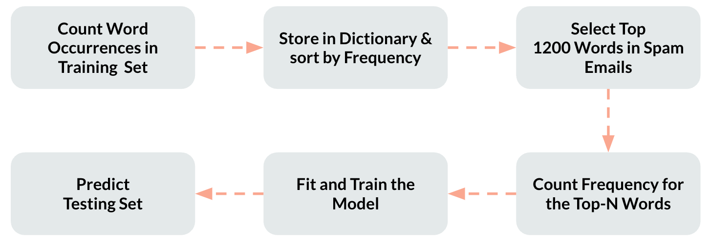

# Identifying Fraudulent Job Postings with ML methods.
## Author:
- [Yuxin Miao](https://github.com/Eric-Miao)
- [Morris Chang](https://github.com/morrischangtwn)
- [Shuyao Wang]()
## Introduction
- Increase usage of online employment websites have lead to increase in fraudulent job postings.
- Fraudulent job posting have two main goals:
    - Acquire confidential personal information. 
    - Solicit unlawful payments
- **GOAL:** Develop a Natural Language Processing (NLP) model that is able to detect fake job postings based on the textual description of the jobs. 
- Utilize different kind of machine learning models and algorithms to identify patterns or anomalies. 

## Data
### Data Acquisition 
- Employment Scam Aegean Dataset (EMSCAD http://emscad.samos.aegean.gr/)  
- Published by the University of the Aegean’s Laboratory of Information & Communication Systems Security 
- Publicly Available Dataset that contains 17,880 real-life job postings online. 
    - 17,014 Legitimate Job Postings and 866 fraudulent job postings. 
- EMSCAD records were manually annotated and classified into two categories between 2012-2014.

### Data Cleaning and Preprocessing
- Base on HTML/text features
    - Concatenate String & Nominal features if not existed before
- Remove
    - Stop words
    - Punctuations
    - etc. 
- Keep
    - Numbers
    - Text
    - etc. 
- Traget: *Fraudulent*
    - T == 1
    - F == 0

## Model
### Traditional Models - Bag of Words
Two approaches for Bag of Words to generate features:
1. Custom Top n-words Model
    - From TOP 50 - 1200 words (in frequency)
    


2. CountVectorizer
    - n-gram (1, 2, 3, 4)
    - including 1, 2, 3, 4-grams repectively, as well as the combination of different grams.
    


The Features are then applied to **Logistic Regression** and **Random Forest** models.
### Neural Network
#### LSTM
- General typical 3-layer LSTM model.


#### BERT
- Bidirectional Encoder Representations from Transformers
- Based on the pre-trained model from Google with our own dataset to fine tune. 


## Evaluation
1. Traditional Models work well on this case.
2. Neural Network Models are good in some way
    - BERT reduces false positives
    - LSTM reduces false negative 
    - Cannot achieve both in a single model
    - Need more complex structure to capture more relationships and more data to train the model. 

## References
1. http://emscad.samos.aegean.gr/
2. https://www.mdpi.com/1999-5903/9/1/6/htm 

## Project Structure
```
.
├── README.md    
├── train.sh   #shell script for train
├── test.sh    #shell script for test
├── Code/
│   ├── 00_Data_processing.py    #Process the raw data to usable data and do train-test split
│   ├── 01_RandomForest.py       
│   ├── 02_LogisticRegression.py 
│   ├── 03_Bow.py                
│   ├── 04_FeatureEnginnering.py 
│   ├── 05_LSTM.py               
│   ├── 06_BERT.py                    
│   ├── test.py                  
│   ├── train.py
│   └── Jupyter Notebooks        #This folder stores the raw jupyter notebooks used to compose and tune models/
│       ├── BERT.ipynb              
│       ├── BoWs_feature.ipynb      
│       ├── LSTM.ipynb              
│       └── Traditional_Model.ipynb         
├── Data/
│   ├── emscad_v1.csv            #Raw data
│   ├── text.csv                 #Processed usable data
│   ├── train.csv                #Train data after train-test split 
│   ├── test.csv                 #Test data after train-test split
│   ├── train_balanced.csv       #Balanced train data 
│   ├── test_balanced.csv        #Balanced test data
│   ├── Model_Compare_BERT.xlsx  #Recordings of BERT hyperparameter tuning
│   └── Model_Compare_LSTM.xlsx  #Recordings of LSTM hyperparameter tuning     
├── Model   #Pre-trained models and temporary model storage/
│   ├── BERT_MODEL  #Pre-trained and tuned BERT model                       
│   ├── LSTM_MODEL  #Pre-trained and tuned LSTM model
│   └── ...         #Other temporary model generated during training.
└── Asset  
```
